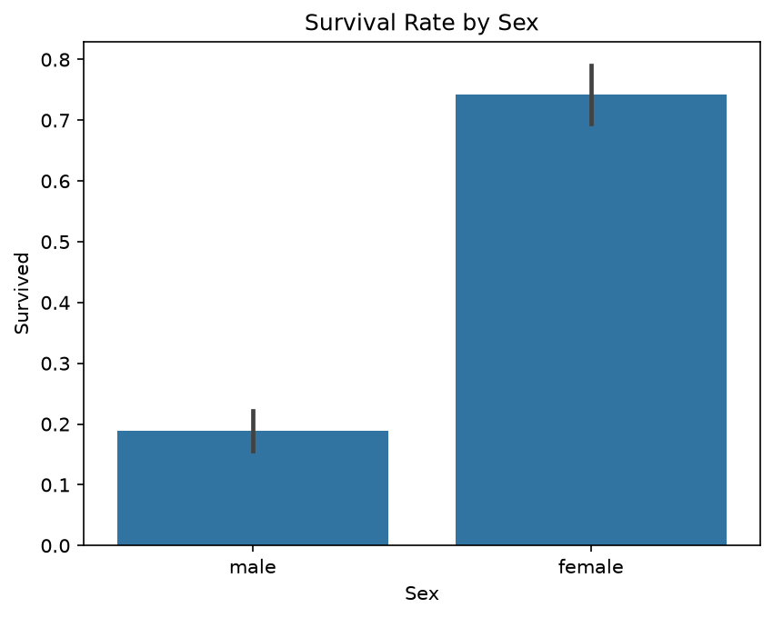
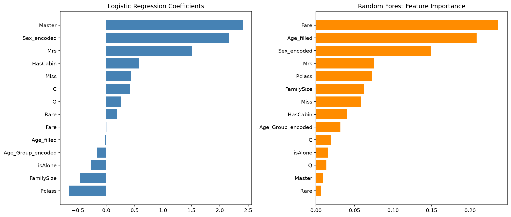

# Titanic Survival Prediction

A complete data science / machine learning project predicting Titanic passenger survival.

**Kaggle leaderboard score: 78.5% accuracy**


## Approach

- Phase 1: Exploratory Data Analysis (a first overview of the data we are working with)
- Phase 2: Data Cleaning (null values were filled appropriately, columns with many null values were appropriately dealt with)
- Phase 3: Feature Engineering (new features were created offering more useful data for the models)
- Phase 4: Preprocessing Pipeline (new columns, train.csv split to train/validation data, logic from Phases 2-3 transferred to preprocessing.py)
- Phase 5: Model Training & Comparison (Logistic Regression, KNN, Random Forest, Gradient Boosting)
- Phase 6: Evaluation (Confusion Matrix, Precision/Recall, F1, ROC/AUC for all models)
- Phase 7: Hyperparameter Tuning (GridSearchCV tuning for each model)
- Phase 8: Final Model (retrained the best model on the full dataset and generated Kaggle predictions)


## Key Findings

- **Sex is the strongest indicator of survival**: Women ~74%, Men ~19%


- **Class and Sex had a very strong effect when viewed together**: 1st class Women ~97%, 3rd class Men ~13%


- **Family size had a non-linear relationship with survival** — small families (2-4 people) survived best (~72%), while both solo travelers (~30%) and large families (~13-20%) fared worse


- **Different models relied on different features** despite similar accuracy — Logistic Regression leaned heavily on the engineered `Title` feature, while tree-based models found more signal directly in `Fare` and `Age`


- **Hyperparameter tuning mattered most for the most flexible models** — Random Forest improved by 2.8 points after tuning, while Logistic Regression's default settings were already optimal


## Project Structure
```
titanic-ml-project/
├── data/                       # raw datasets (not tracked in git)
├── images/                     # contains plots
├── notebooks/
│   ├── 01_exploration.ipynb    # EDA, cleaning, feature engineering
│   ├── 02_modeling.ipynb       # model training, evaluation, tuning
│   └── 03_submission.ipynb     # final model + Kaggle submission
├── src/
│   └── preprocessing.py        # reusable, tested preprocessing pipeline
├── requirements.txt
└── README.md
```


## Model Comparison (5-fold cross-validated)

| Model | CV Accuracy | Precision | Recall | F1 | AUC |
|---|---|---|---|---|---|
| Logistic Regression | 82.9% | 78.9% | 75.7% | 77.2% | 0.891 |
| KNN (K=9) | 82.2% | 83.6% | 75.7% | 79.4% | 0.894 |
| Random Forest (tuned) | **83.6%** | 77.3% | 78.4% | 77.9% | 0.907 |
| Gradient Boosting (tuned) | 82.7% | 81.2% | 75.7% | 78.3% | 0.898 |


**Final model:** Random Forest (`n_estimators=200, max_depth=5, min_samples_split=5`)


## Results

The tuned Random Forest scored **78.5%** on Kaggle's public leaderboard — notably lower than its 83.6% cross-validated estimate. This gap is likely due to the leaderboard being computed on a different sample than the training data used for cross-validation, and is itself a useful finding: cross-validated metrics, however carefully computed, don't perfectly predict performance on genuinely new data.


## Setup
1. Create venv: `python -m venv venv`
2. Activate: `venv\Scripts\activate`
3. Install deps: `pip install -r requirements.txt`
4. Download data from Kaggle: https://www.kaggle.com/c/titanic/data → place in `data/`
